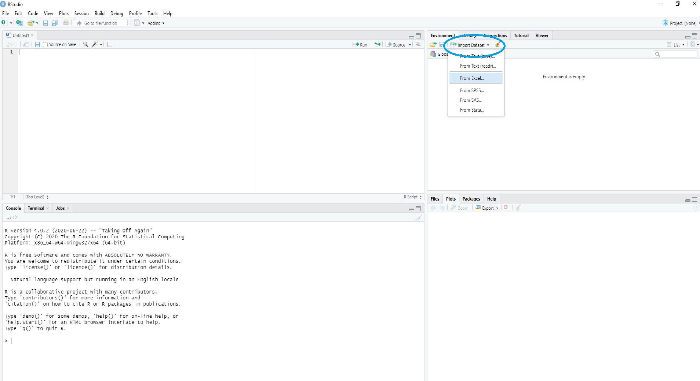

# Welcome to Line by Tester Analysis 

[](https://mybinder.org/v2/gh/nandp1/Line-Tester-Analysis/master) 

 
  Here we learn on how to conduct Line by Tester analysis which is the most common design used by Plant Breeders to estimate Combining ability and Genetic variances. 


**Contents**

[Data Arrangement and Structure](https://nandp1.github.io/Line-Tester-Analysis/#data-arrangement-and-structure)

[Method 1](https://github.com/nandp1/Line-Tester-Analysis/blob/master/README.md#method-1)

[Method 2](https://github.com/nandp1/Line-Tester-Analysis/blob/master/README.md#method-2)
##  Setup R for your Computer

R is a programming language and free software used for Statistical computation. 
1. Download and Install the [R base](https://cloud.r-project.org/) package
2. Download and Install the free version of [R Studio](https://rstudio.com/products/rstudio/download/) 


## Data Arrangement and Structure 

To begin the analysis first arrange the data into four columns namely `replication`, `line`, `tester` and `yield` in an excel file. 

> Note that an additional coloumn of `blocks` has to be added if its Incomplete Block Design (IBD). 

## Importing data in R

After you have created your data file, paste it in your Working Directory. By default your working directory is Documents folder. 
We import the excel data file (Example: ltdata) by, 

```ltdata = read_excel("ltdata.xlsx")```

**Or**

You can just click on Import dataset and select your excel file. 




Viewing Imported data

```View(ltdata)```


## Method 1 
## By agricolae package 

-  Install package **agricolae** 

```install.packages('agricolae', dependencies=True)```   
                                     
- Loading the installed package 

```library(agricolae)```

- Understanding the struture of dataset. 

```str(ltdata)```

> Note: There are two example Line x Tester dataset in agricole package named as **heterosis** and **LxT**. You can load them by,

```data(heterosis)```

```data(LxT)```

- Now using the function `lineXtester` of the agricolae package we perform Line x Tester analysis. 

```result = with(ltdata,lineXtester(replication, line, tester, yield))```

 > Analysing heterosis dataset. 
 
``` result2 = with(heterosis,lineXtester(Replication, Female, Male, v1))```

> Results are displayed which can be copied and saved. 

## Method 2
## Bt plantbreeding package

Line x Tester analysis by `plantbreeding` package

-  Install package **plantbreeding** 

```install.packages("plantbreeding", repos="http://R-Forge.R-project.org", dependencies= T)```   
                                     
- Loading the installed package 

```library(plantbreeding)```

- linetester is an example dataset in the package. Loading and view the dataset.
```data(linetester)```

```View(linetester)```

> Note that dataset has two addtional coloumns genotypes and gclass. genotypes is the name of the cross or parent. Ex: 1x2, 2x3, 2, 3. gclass metions whether the genotypes is cross or a parent. Thus, we have to add two addtional coloumns to ltdata. 


- Analysing the ltdata by `line.tester` function. 

```result3 <- line.tester(dataframe = linetester, yvar = "trait1",  genotypes = "genotypes",  replication = "replication",  Lines = "Lines", Testers = "Tester", gclass = "gclass" ) ```
```print(result3)```

- Saving the results 

```ltresult = capture.output(print(result3), "ltresult.txt")```


[All the script can be found on Github](https://github.com/nandp1/Line-Tester-Analysis) 

This is an open source webpage make your contribution and help us to improve. 

Contact me for any query 

**Nandan L. Patil**

**patilnads@gmail.com**

[Sponsar this project](https://issuehunt.io/r/nandp1/Line-Tester-analysis)


