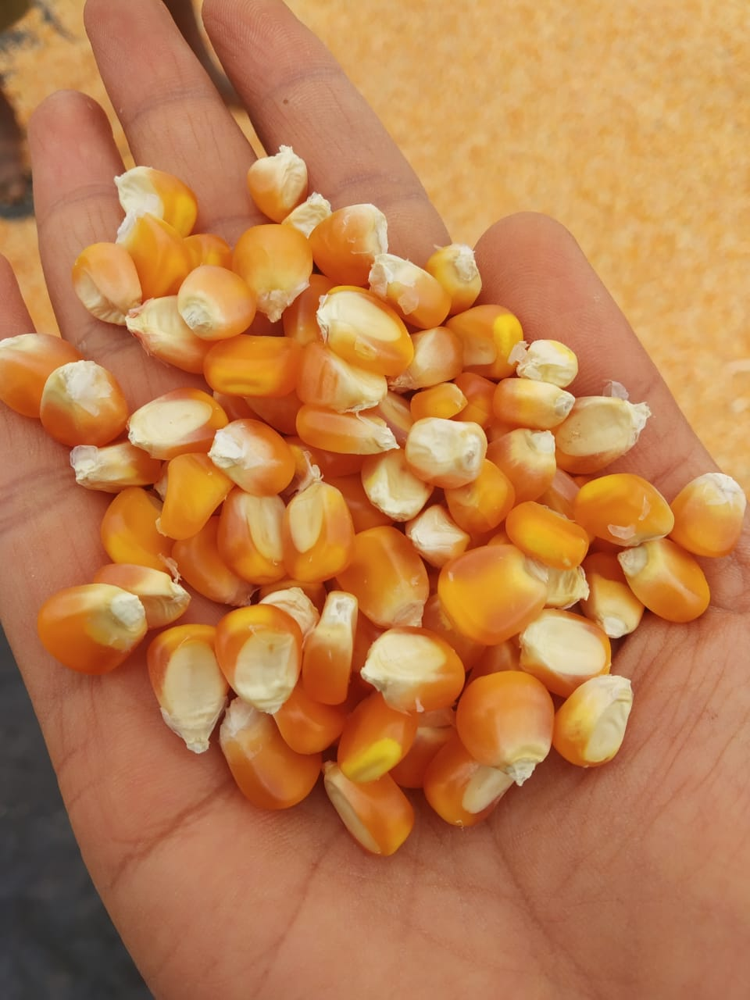

# Welcome to Line by Tester Analysis 

  Here we learn on how to conduct Line by Tester analysis which is the most common design used by Plant Breeders to estimate Combining ability and Genetic variances. 


**Contents**

[Data Arrangement and Structure](https://nandp1.github.io/Line-Tester-Analysis/#data-arrangement-and-structure)

[Method 1](https://github.com/nandp1/Line-Tester-Analysis/blob/master/README.md#method-1)

##  Setup R for your Computer

R is a programming language and free software used for Statistical computation. 
1. Download and Install the [R base](https://cloud.r-project.org/) package
2. Download and Install the free version of [R Studio](https://rstudio.com/products/rstudio/download/) 


## Data Arrangement and Structure 

To begin the analysis first arrange the data into four columns namely `replication`, `line`, `tester` and `yield` in an excel file. 

> Note that an additional coloumn of `blocks` has to be added if its Incomplete Block Design (IBD). 

## Importing data in R

After you have created your data file, paste it in your Working Directory. By default your working directory is Documents folder. 
We import the excel data file (Example: ltdata) by, 

```ltdata = read_excel("ltdata.xlsx")```

**Or**

You can just click on Import dataset and select your excel file. 


Viewing Imported data

```View(ltdata)```


## Method 1 
## By agricolae package 

- Open R Studio and install package called **agricolae** 

```install.packages('agricolae', dependencies=True)```   
                                     
- Loading the installed package 

```library(agricolae)```

- Understanding the struture of dataset. 

```str(ltdata)```

> Note: There are two example Line x Tester dataset in agricole package named as **heterosis** and **LxT**. You can load them by,

```data(heterosis)```

```data(LxT)```

- Now using the function `lineXtester` of the agricolae package we perform Line x Tester analysis. 

```result = with(ltdata,lineXtester(replication, line, tester, yield))```

 > Analysing heterosis dataset. 
 
``` result2 = with(heterosis,lineXtester(Replication, Female, Male, v1))```

> Results are displayed which can be copied and saved. 





